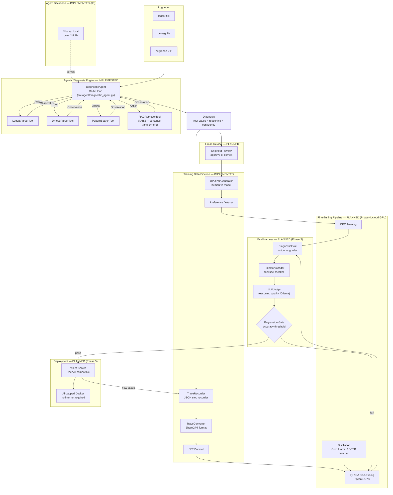

# Architecture: Logcat Intelligence Engine

> A self-improving AI diagnostic system for Android OS logs. This document is
> the single place to explain the *whole* system — what it does, why every
> piece exists, and how the AI/ML machinery works end to end. For deep dives
> into any one subsystem, see `docs/components/`.

---

## 1. The One-Paragraph Pitch

The Logcat Intelligence Engine ingests raw Android diagnostic artifacts
(logcat, dmesg, bugreports) and uses a **ReAct agent** — an LLM that
alternates between reasoning and calling tools — to investigate the artifact
and produce a root-cause diagnosis with supporting evidence. Every
investigation is logged as a structured **trace**. Traces get converted into
**training data** (supervised fine-tuning examples, and preference pairs from
human corrections). That data is used to **fine-tune** a local 7B model
(Qwen2.5-7B-Instruct) with QLoRA + DPO. An **eval harness** measures whether
the fine-tuned model actually improved before it's allowed to deploy. The
model serves via **vLLM** inside an **airgapped Docker container** — no
internet access needed at inference time. New investigations keep feeding
back into training, so the model compounds in quality over time. That
feedback loop — not the model itself — is the actual product; see
[`docs/components/08-flywheel.md`](components/08-flywheel.md).

---

## 2. Goals & Success Metrics

| Goal | Target | Why it matters |
|---|---|---|
| Diagnostic accuracy | >70% exact-match root cause (baseline ~30% zero-shot) | Quantifies whether fine-tuning actually helped — "if it doesn't show up in the eval, it didn't happen" |
| Fine-tuning improvement | 15–25% accuracy gain over base model | Demonstrates the QLoRA/DPO pipeline is doing real work, not noise |
| Inference latency | <3s per diagnosis (target hardware: A10G GPU) | Diagnosis needs to be fast enough to be part of an interactive workflow |
| Flywheel trigger | Auto-retrain after every 100 new verified diagnoses | Defines the cadence of the self-improvement loop |
| Airgapped deployment | Zero external network calls after the Docker image is built | Production/security requirement for on-device or restricted-network diagnostic tooling |
| **Build cost (this instance)** | **$0** | Local Ollama + Groq free tier + Kaggle free T4 + HF/WandB free tiers — see [Section 6](#6-tech-stack--why-each-choice) |

---

## 3. Full System Architecture



**Status legend used throughout this doc and `docs/components/`:**
`IMPLEMENTED` = real code exists and has been run/verified. `PLANNED` = designed
(this repo's plan + the source capstone spec), not yet built. Check
`CONTEXT.md` at the project root for the live status table.

---

## 4. Layered View

Think of the system as seven layers, each consuming the layer below:

1. **Ingestion** — raw text/ZIP artifacts (logcat, dmesg, bugreport) land in `data/raw/`.
2. **Parsing** — regex-based structured extraction (`src/parsers/`) turns raw text into typed entries (`LogcatEntry`, `DmesgEntry`) with derived signals (crash/ANR/OOM/GPU-fault/panic flags).
3. **Agentic reasoning** — the `DiagnosticAgent` (`src/agent/`) is the brain: it decides *which* parser/tool to call, in what order, based on what it's already learned, using a ReAct (Reason + Act) loop against a local LLM.
4. **Knowledge retrieval** — `RAGRetrieverTool` lets the agent ground its reasoning in similar past cases (embedding similarity search over a FAISS index), not just the current log file.
5. **Training data generation** — every investigation trace is a labeled example; `TraceConverter` turns it into SFT training data, and human corrections turn into DPO preference pairs.
6. **Model improvement** (planned) — QLoRA fine-tuning + DPO + distillation turn the accumulated traces into a better 7B model, gated by the eval harness.
7. **Serving + feedback** (planned) — the improved model deploys via vLLM, and its new investigations become tomorrow's training data. Closed loop.

Layers 1–5 are built and verified today. Layers 6–7 are designed in detail
(see the relevant `docs/components/*.md`) and scheduled for the next build
pass, since both need a cloud GPU per `capstone-build-requirements.md`.

---

## 5. End-to-End Data Flow (Concrete Example)

Walking one investigation through the whole (eventual) pipeline, using the
`crash` synthetic scenario that's actually been run:

1. `scripts/generate_synthetic_logs.py` writes `data/raw/sample_logcats/crash.txt` containing a `FATAL EXCEPTION: main` / `NullPointerException` sequence.
2. `DiagnosticAgent.investigate(logcat_path=..., description="App crashes immediately on launch...")` starts a ReAct loop against `qwen2.5:7b` via Ollama.
3. Step 0: agent calls `logcat_parser` → gets `{crash_detected: true, error_count: 3, top_tags: [...]}`.
4. Step 1: agent calls `pattern_search` with a regex targeting the NPE stack frame.
5. Step 2: agent calls `rag_retriever("NullPointerException in MainActivity.java")` → FAISS returns the closest seed case (`seed_crash_01`, "Null reference accessed before initialization completed...").
6. The agent synthesizes a **Final Answer**: `root_cause`, `root_cause_category="crash"`, `confidence=0.95`, `evidence=[...]`, `recommended_action=...`.
7. *(Planned)* `TraceRecorder.record(...)` appends the full step-by-step trace + final diagnosis to `data/raw/traces.jsonl`.
8. *(Planned)* A human engineer reviews the diagnosis in a review UI/CLI — approves it, or corrects it.
   - Approved + confidence ≥ 0.5 → `TraceConverter` turns it into a ShareGPT-format SFT record in `data/sft/train.jsonl`.
   - Corrected → `DPOPairGenerator` creates a preference pair: `chosen=human correction`, `rejected=original model diagnosis`, written to `data/dpo/train.jsonl`.
9. *(Planned)* Once 100 new verified traces accumulate, `flywheel/auto_trigger.py` kicks off `scripts/weekly_retrain.sh`: QLoRA SFT → DPO → merge adapter → run `DiagnosticEval` → `regression_gate.should_deploy()` decides whether to rebuild the Docker image.
10. *(Planned)* If the gate passes, a new versioned Docker image (`logcat-ie-serve:vN`) is built with the merged weights baked in, and vLLM serves it — airgapped, OpenAI-compatible `/v1/chat/completions`.

---

## 6. Tech Stack & Why Each Choice

| Concern | Choice | Why |
|---|---|---|
| Agent reasoning pattern | **ReAct** (Reason→Act→Observe loop) | Lets a single LLM call multiple specialized tools and revise its plan based on real evidence, instead of one-shot classification. Directly demonstrates "agentic systems" competency. |
| Agent backbone (dev) | **Ollama, `qwen2.5:7b`, local** | $0 cost, runs entirely on 24GB Apple Silicon RAM, no rate limits, no data leaves the machine. |
| Tool-call parsing | Regex over free-form completions (`Thought:`/`Action:`/`Action Input:`/`Final Answer:`) | Matches the reference implementation exactly; no function-calling API needed, works with any OpenAI-compatible chat endpoint (Ollama, vLLM, or a hosted model interchangeably). Trade-off: fragile to format drift — this fragility is *why* the eval harness and fine-tuning exist (see [`docs/components/01-diagnostic-agent.md`](components/01-diagnostic-agent.md#known-limitation)). |
| Retrieval | **FAISS (`IndexFlatL2`) + `sentence-transformers` (`all-MiniLM-L6-v2`)** | Free, local, no vector DB service to run. Exact L2 search is fine at this corpus size (tens to low-thousands of cases); would swap for `IndexIVFFlat`/`HNSW` only if the case corpus grew past ~100k. |
| Base model for fine-tuning | **Qwen2.5-7B-Instruct** | Free on HuggingFace, strong instruction-following at 7B, fits comfortably in 4-bit on a single consumer/free-tier GPU. |
| Fine-tuning method | **QLoRA** (4-bit NF4 quantized base + LoRA adapters) | Full fine-tuning of a 7B model needs ~60GB+ VRAM; QLoRA fits in ~12–16GB, runs on a free Kaggle T4 (16GB). Demonstrates parameter-efficient fine-tuning depth. |
| Preference optimization | **DPO** (Direct Preference Optimization) via TRL | Turns human corrections directly into training signal without needing a separate reward model (unlike classic RLHF/PPO) — simpler pipeline, same effect. |
| Distillation teacher | **Groq free tier, Llama 3.3 70B** (proxy for a "72B teacher") | $0 instead of Claude Opus/GPT-4o; still a much larger, more capable model whose outputs the 7B student can imitate. |
| Cloud GPU for training | **Kaggle Notebooks (free T4, 30 hr/week)** | Only free option with a real CUDA GPU; `bitsandbytes` and `vllm` don't run on Apple Silicon at all. |
| Experiment tracking | **WandB (free tier)** | Standard for tracking loss curves / hyperparameters — a portfolio artifact interviewers expect to see. |
| Serving | **vLLM**, OpenAI-compatible `/v1/chat/completions` | High-throughput inference server; same client code (`openai` SDK) works against Ollama in dev and vLLM in prod — zero code change to `DiagnosticAgent`. |
| Deployment | **Airgapped Docker** (weights baked in via `COPY` at build time) | Proves production awareness: a diagnostic tool for e.g. a secure device lab can't depend on live internet access. |
| Regression safety | **Regression gate** (accuracy floor + max allowed drop vs. previous version) | Prevents a bad retrain from silently replacing a working model — the automation equivalent of "don't ship a regression." |

---

## 7. AI/ML Concepts Glossary (for explaining this project)

**ReAct (Reason + Act)** — A prompting pattern where the model alternates
`Thought` (free-text reasoning) → `Action` (a tool call) → `Observation`
(the tool's result), looping until it emits a `Final Answer`. It's how the
agent decides *which* diagnostic step to take next based on what it's
already found, rather than following a fixed script. Implemented in
`DiagnosticAgent.investigate()`.

**Tool-use / function-calling** — Giving an LLM a fixed set of callable
capabilities (here: `logcat_parser`, `dmesg_parser`, `pattern_search`,
`rag_retriever`) with a name, description, and expected arguments, so it can
delegate work it can't do itself (regex search, structured parsing, vector
lookup) to deterministic code.

**RAG (Retrieval-Augmented Generation)** — Instead of relying only on what
the LLM "knows," retrieve semantically similar prior cases from an external
store (FAISS) and inject them into the context so the model can ground its
answer in concrete precedent. Here: `RAGRetrieverTool` embeds the query with
`all-MiniLM-L6-v2`, searches a `FAISS.IndexFlatL2`, returns the top-k most
similar past diagnoses.

**Embedding similarity search** — Text is converted into a fixed-length
vector (384-dim for MiniLM) such that semantically similar text produces
vectors that are close in Euclidean/cosine space. FAISS finds the k nearest
vectors to a query vector far faster than brute-force comparison at scale.

**SFT (Supervised Fine-Tuning)** — Continuing to train a pretrained model on
(input, desired-output) pairs — here, ShareGPT-format conversations built
from *successful* agent investigation traces — so the model imitates the
reasoning pattern and output format directly, rather than needing an elaborate
prompt each time.

**LoRA (Low-Rank Adaptation)** — Instead of updating all of a model's
weights during fine-tuning, freeze the base model and inject small trainable
low-rank matrices (`rank r`, scaled by `alpha`) into specific weight
projections (`q_proj`, `k_proj`, `v_proj`, `o_proj`, `gate_proj`, `up_proj`,
`down_proj`). Trains <1% of the parameters, at a fraction of the memory cost.

**QLoRA** — LoRA on top of a base model that's been quantized to 4-bit
(NF4 format, double-quantization) so it fits in far less GPU memory during
training. This is *why* a 7B model's fine-tuning fits on a free 16GB T4.

**DPO (Direct Preference Optimization)** — A way to train a model to prefer
one response over another (`chosen` vs. `rejected`) without a separate reward
model or PPO-style reinforcement learning loop — it directly optimizes a
classification-like loss over the preference pairs. Here: `chosen` = a human
engineer's corrected diagnosis, `rejected` = the model's original (wrong or
incomplete) diagnosis.

**Knowledge distillation** — Training a small "student" model (Qwen2.5-7B)
to imitate the outputs of a much larger "teacher" model (Llama 3.3 70B via
Groq) on the same tasks, so the student captures some of the teacher's
quality at a fraction of the inference cost.

**Eval harness / LLM-as-judge** — Deterministic graders (exact-match category
accuracy, keyword hit rate) combined with an LLM prompted to score
*reasoning quality* on a 0–10 scale — because "did it use the tools in a
sensible order" and "was the explanation coherent" aren't things a simple
string match can capture.

**Regression gate** — An automated go/no-go check that blocks deployment
if the new model's eval accuracy falls below an absolute floor, or drops too
far below the currently-deployed model's accuracy — the ML equivalent of a
CI test gate.

**Training flywheel** — The compounding loop: agent runs → traces logged →
enough new traces accumulate → auto-retrain triggers → eval gate → deploy if
it passes → the improved model produces new (hopefully better, definitely more)
traces → repeat. The system's value grows with usage, not just with
one-time engineering effort.

---

## 8. Directory Map

```
logcat-intelligence-engine/
├── CONTEXT.md                  # Live project status — read this first each session
├── docs/
│   ├── ARCHITECTURE.md         # This file
│   └── components/             # One deep-dive per subsystem
├── data/
│   ├── raw/                    # Synthetic (and later real) logcat/dmesg files [gitignored]
│   ├── processed/              # seed_cases.jsonl (tracked) + generated FAISS index [artifacts gitignored]
│   ├── sft/, dpo/              # Training datasets (Phase 2, populated + committed)
│   ├── eval/                    # Eval datasets (Phase 3, not yet populated)
├── src/
│   ├── parsers/                # LogcatParser, DmesgParser, BugreportParser — IMPLEMENTED
│   ├── agent/                  # tools.py, diagnostic_agent.py, prompts.py — IMPLEMENTED
│   ├── training/                # TraceRecorder, DPOPairGenerator, dedup, stats — IMPLEMENTED
│   ├── eval/                   # DiagnosticEval, TrajectoryGrader, LLMJudge — PLANNED (Phase 3)
│   ├── finetune/               # QLoRA config, train_sft/train_dpo, distill, merge_adapter — PLANNED (Phase 4)
│   ├── serve/                  # health check, example client — PLANNED (Phase 5)
│   └── flywheel/               # auto_trigger, regression_gate, version_tracker — PLANNED (Phase 6)
├── scripts/                     # validate_env, generate_synthetic_logs, build_case_index, run_agent_demo
└── docker/                      # Dockerfile.train, Dockerfile.serve, docker-compose.yml — PLANNED (Phase 5)
```

---

## 9. How This Maps to an Interview Conversation

| Question | What to say, grounded in this repo |
|---|---|
| "Tell me about a system you built" | "A self-improving diagnostic agent for Android logs. It's a ReAct agent with 4 tools — I built the full parsing + tool + agent loop and verified it end-to-end against a local 7B model before touching any cloud infrastructure." |
| "How do you eval an LLM system?" | "I separate outcome grading (did it get the right root-cause category, keyword coverage) from process grading (did it call tools in a sensible order) from LLM-as-judge (is the reasoning actually coherent) — see `docs/components/06-eval-harness.md`." |
| "Have you done fine-tuning?" | "QLoRA on Qwen2.5-7B — r=16, alpha=32, 4-bit NF4, targeting the attention and MLP projections. Ran on a free Kaggle T4 since QLoRA's whole point is fitting large-model fine-tuning into consumer-grade VRAM." |
| "What is DPO and why not RLHF/PPO?" | "DPO skips the separate reward model and RL loop — you directly optimize on (chosen, rejected) pairs. My chosen/rejected pairs come straight from human corrections of the agent's diagnoses." |
| "How do you deploy an LLM safely?" | "Behind a regression gate — a new fine-tuned model only replaces the deployed one if its eval accuracy holds above a floor and doesn't regress more than a threshold from the previous version." |
| "What was the hardest engineering trade-off?" | "Regex-based ReAct parsing is fragile — a 7B model sometimes drifts from the exact `Thought/Action/Action Input` format. Rather than patch around it with a stricter parser, I treated that fragility as *signal*: it's exactly what the eval harness measures and what fine-tuning is meant to fix." |

---

## 10. Where to Go Next

- Full ReAct agent logic, prompt design, parsing regexes, known limitations → [`components/01-diagnostic-agent.md`](components/01-diagnostic-agent.md)
- Logcat/dmesg/bugreport parsing rules → [`components/02-parsers.md`](components/02-parsers.md)
- Embedding + FAISS retrieval mechanics → [`components/03-rag-retrieval.md`](components/03-rag-retrieval.md)
- Trace → SFT/DPO data pipeline → [`components/04-training-data-pipeline.md`](components/04-training-data-pipeline.md)
- QLoRA + DPO + distillation (planned) → [`components/05-finetuning-pipeline.md`](components/05-finetuning-pipeline.md)
- Eval harness, trajectory grading, LLM judge (planned) → [`components/06-eval-harness.md`](components/06-eval-harness.md)
- vLLM + airgapped Docker (planned) → [`components/07-deployment-serving.md`](components/07-deployment-serving.md)
- Auto-retrain flywheel + regression gate (planned) → [`components/08-flywheel.md`](components/08-flywheel.md)
- Live phase status, decisions log → `CONTEXT.md` (project root)
