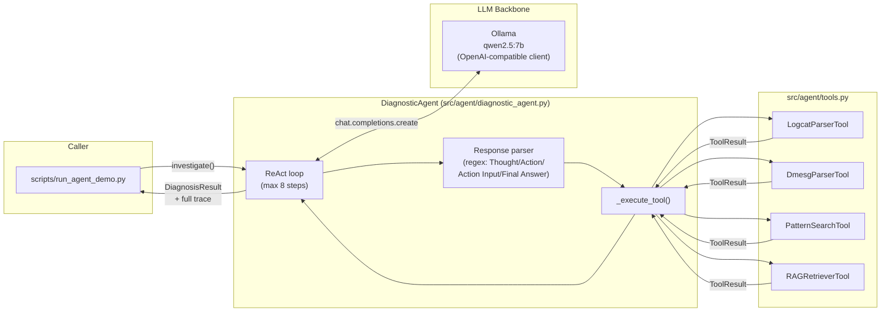
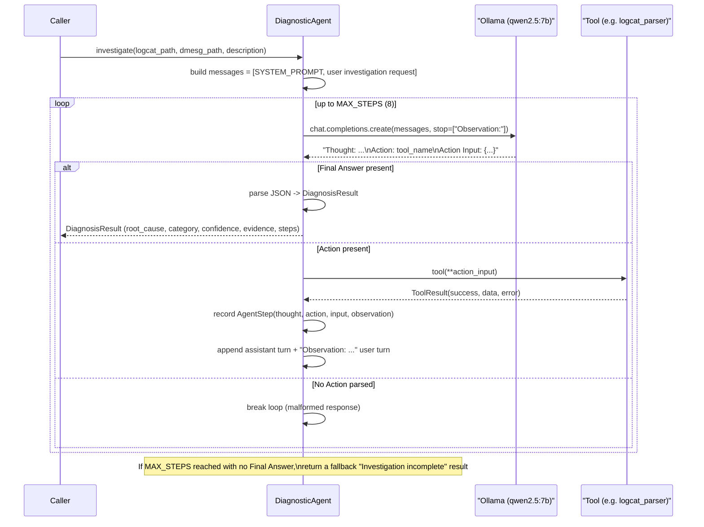

# Component: Diagnostic Agent (ReAct Loop)

**Status: IMPLEMENTED** — `src/agent/diagnostic_agent.py`, `src/agent/tools.py`, `src/agent/prompts.py`

This is the core "brain" of the system: an LLM that investigates an Android
log artifact by iteratively reasoning about what to check next and calling
tools to gather evidence, until it's confident enough to produce a final
diagnosis.

---

## 1. What Problem This Solves

A raw logcat file can be tens of thousands of lines. Rather than stuffing the
whole file into a prompt (expensive, and the model would have to re-derive
structure every time) or hand-writing a rule-based classifier (brittle,
doesn't generalize), the agent is given **narrow, composable tools** —
parsing, regex search, similarity retrieval — and decides for itself which
ones to use, in what order, based on what it's already learned. This is the
"agentic systems" pattern: an LLM as an orchestrator over deterministic
capabilities, not a black box that does everything itself.

---

## 2. Component Diagram



---

## 3. Sequence: One Full Investigation



---

## 4. Data Model

```python
@dataclass
class AgentStep:
    step_index: int        # 0-based position in the trace
    thought: str            # free-text reasoning extracted from the model's response
    action: str             # tool name invoked
    action_input: dict      # parsed JSON arguments passed to the tool
    observation: str        # the tool's result, truncated to 2000 chars
    elapsed_ms: float       # wall-clock time for this step

@dataclass
class DiagnosisResult:
    root_cause: str
    root_cause_category: str   # e.g. "anr", "crash", "oom", "gpu_fault"
    confidence: float           # 0.0-1.0, self-reported by the model
    evidence: list[str]
    recommended_action: str
    steps: list[AgentStep]      # the FULL trace — this is the training data gold
    total_elapsed_ms: float
```

`steps` is the reason this component matters beyond just "getting an answer":
the entire reasoning trajectory is preserved, which is exactly what
`TraceRecorder`/`TraceConverter` (Phase 2, see
[`04-training-data-pipeline.md`](04-training-data-pipeline.md)) turns into
fine-tuning data later.

---

## 5. The ReAct Loop, Step by Step

Implementation: `DiagnosticAgent.investigate()`.

1. **Seed the conversation.** `messages` starts with `SYSTEM_PROMPT`
   (`src/agent/prompts.py`) and a user turn describing the investigation
   (problem description + file paths).
2. **Call the LLM** with `temperature=0.1` (near-deterministic — we want
   reproducible diagnostic behavior, not creative variation),
   `max_tokens=1024`, and `stop=["Observation:"]` so the model doesn't
   hallucinate its own tool output — it must stop right after emitting an
   `Action Input:` and wait for the *real* observation to be injected.
3. **Check for a Final Answer first.** `_FINAL_ANSWER_RE` is checked before
   the action regexes, since a response could theoretically contain both
   (e.g. a final answer that mentions "Action" in prose).
4. **Otherwise, parse `Thought` / `Action` / `Action Input`.** Three
   independent regexes (`_THOUGHT_RE`, `_ACTION_RE`, `_ACTION_INPUT_RE`) pull
   each field out of the raw completion text. If no `Action:` is found at
   all, the loop **breaks immediately** — this is the fragility point
   discussed below.
5. **Execute the tool** via `_execute_tool()`, which looks up the tool by
   name in `self._tools`, calls it with the parsed kwargs, and stringifies
   the result (or the error) as the observation, truncated to 2000 characters
   so the context doesn't blow up over a long investigation.
6. **Append to the conversation** — the model's own turn, then a synthetic
   user turn containing `Observation: {result}` — and loop back to step 2.
7. **Fallback.** If `MAX_STEPS` (8) is reached without a Final Answer, return
   a `DiagnosisResult` with `root_cause_category="unknown"`, `confidence=0.0`,
   so downstream consumers (eval harness, trace recorder) can tell this
   investigation didn't converge rather than silently treating it as a real
   diagnosis.

---

## 6. System Prompt Design (`src/agent/prompts.py`)

The system prompt does three jobs:

- **Establishes persona and scope** ("senior Android OS diagnostic engineer") — this primes the model's tone and the vocabulary it reaches for (kernel terms, Android framework terms).
- **Documents the tool contract** — name, arguments, and what each tool returns, in plain language (not a JSON schema, since we're not using native function-calling — the model has to *read and follow* this from the prompt).
- **Prescribes the exact output grammar** (`Thought:` / `Action:` / `Action Input:` / `Observation:` / `Final Answer:`) and a recommended *investigation order* (logcat → dmesg → pattern search → RAG), which nudges the model toward a systematic rather than random investigation path.

## 7. Tools (`src/agent/tools.py`)

All four tools return a uniform `ToolResult(tool_name, success, data, error)`
so `_execute_tool()` can handle every tool identically regardless of what it
actually does internally.

| Tool | Wraps | Returns |
|---|---|---|
| `LogcatParserTool` | `LogcatParser` (see [02-parsers.md](02-parsers.md)) | error/warning counts, top tags, `anr_detected`/`crash_detected`/`oom_detected` booleans, 5 sample errors |
| `DmesgParserTool` | `DmesgParser` | event-type counts, `gpu_fault`/`oom_kill`/`kernel_panic` booleans, sample events per type |
| `PatternSearchTool` | raw regex over the file, line by line | total match count + up to `max_results` sample lines (line number + text) |
| `RAGRetrieverTool` | `sentence-transformers` + FAISS (see [03-rag-retrieval.md](03-rag-retrieval.md)) | top-k similar past cases with similarity scores |

Every tool catches its own exceptions internally and returns
`ToolResult(success=False, error=str(e))` rather than raising — this matters
because a tool failure (bad regex, missing file) becomes part of the agent's
*context* ("ERROR: ...") rather than crashing the whole investigation. The
agent has genuinely recovered from this in testing: see Section 8.

---

## 8. Known Limitation: Regex-Parsing Fragility

**Observed behavior (2026-07-26 verification run):** against 3 synthetic
scenarios run through local `qwen2.5:7b`:

- **crash** scenario: 5 clean steps, correct diagnosis, confidence 0.95.
- **anr** scenario: 7 steps (including one tool call with an empty
  `file_path` that the tool correctly rejected with an `ERROR:` observation,
  which the agent then recovered from on the next step), correct diagnosis,
  confidence 0.85.
- **gpu_fault** scenario: the model's step-3 response didn't match
  `_ACTION_RE` (it drifted from the exact `Action: tool_name` format), so the
  loop hit `if not action_match: break` and fell through to the `MAX_STEPS`
  fallback — `root_cause_category="unknown"`, `confidence=0.0`, even though
  the dmesg tool call in step 1 had already surfaced the GPU fault evidence.

**This is not a bug to silently patch** — it's the exact phenomenon the
capstone's whole second half exists to address:

- It's *why* the eval harness (Phase 3) scores category accuracy AND
  trajectory quality separately from final-answer correctness — a model can
  gather the right evidence and still fail to *format* a parseable answer.
- It's *why* the baseline zero-shot accuracy target is only ~30% — format
  drift on a 7B instruct model under a hand-rolled parser (vs. native
  function-calling) is expected, not exceptional.
- It's *exactly* what SFT fine-tuning (Phase 4) is meant to fix: training on
  successful traces teaches the model to reliably reproduce the
  `Thought/Action/Action Input/Final Answer` grammar, because that grammar
  is baked into every training example's target output.

**If this needs to be more robust before Phase 4** (e.g. to collect more
usable traces faster), the cheapest fix is a fallback re-prompt ("Your last
response didn't include a valid Action or Final Answer — please retry using
the exact format") rather than a stricter regex, since the format problem is
in the model's *generation*, not in how we're parsing it.

---

## 8b. Bug Found & Fixed: Unguarded Tool-Argument Errors (2026-07-26)

Running `scripts/collect_traces.py` (Phase 2's trace collection, see
[04-training-data-pipeline.md](04-training-data-pipeline.md#8-verified-run-2026-07-26))
across 20 real investigations — rather than the 3 hand-picked scenarios used
to originally verify Phase 1 — crashed the whole process:

```
TypeError: PatternSearchTool.__call__() missing 2 required positional arguments: 'file_path' and 'pattern'
```

The model emitted a tool call with a missing or malformed `Action Input`
(parsed as `{}`), and `_execute_tool()` called `tool(**args)` with no guard
around Python's own argument-binding — a `TypeError` here happens *before*
the tool's own body (and its internal `try/except`, see
[Section 7](#7-tools-srcagenttoolspy)) ever runs, so nothing inside any tool
could have caught it. Fixed by wrapping that specific call in `_execute_tool`:

```python
try:
    result: ToolResult = tool(**args)
except TypeError as e:
    return f"ERROR: Invalid arguments for '{tool_name}': {e}"
```

This is the same lesson as the format-drift limitation above, generalized:
**failure modes that only show up at real usage volume are exactly what
production trace collection is for.** A 3-scenario demo never happened to
trigger this; running 20 investigations across all 10 categories did on the
very first attempt.

---

## 9. How to Explain This Component in an Interview

- "I didn't use native function-calling — I implemented the classic ReAct
  `Thought/Action/Observation` text protocol with a regex parser, which
  means the exact same agent code works unmodified against Ollama locally,
  a hosted API, or my own fine-tuned vLLM server later — it's just an
  OpenAI-compatible `chat.completions` call."
- "Every tool call and its result is preserved in a structured trace, not
  just the final answer — that trace *is* the training data for the next
  fine-tuning round."
- "I intentionally didn't over-engineer the parser to paper over model
  format drift, because that drift is real evaluation signal — it shows up
  directly in my eval harness's trajectory and outcome scores, and gets
  fixed by fine-tuning, not by defensive parsing code."
