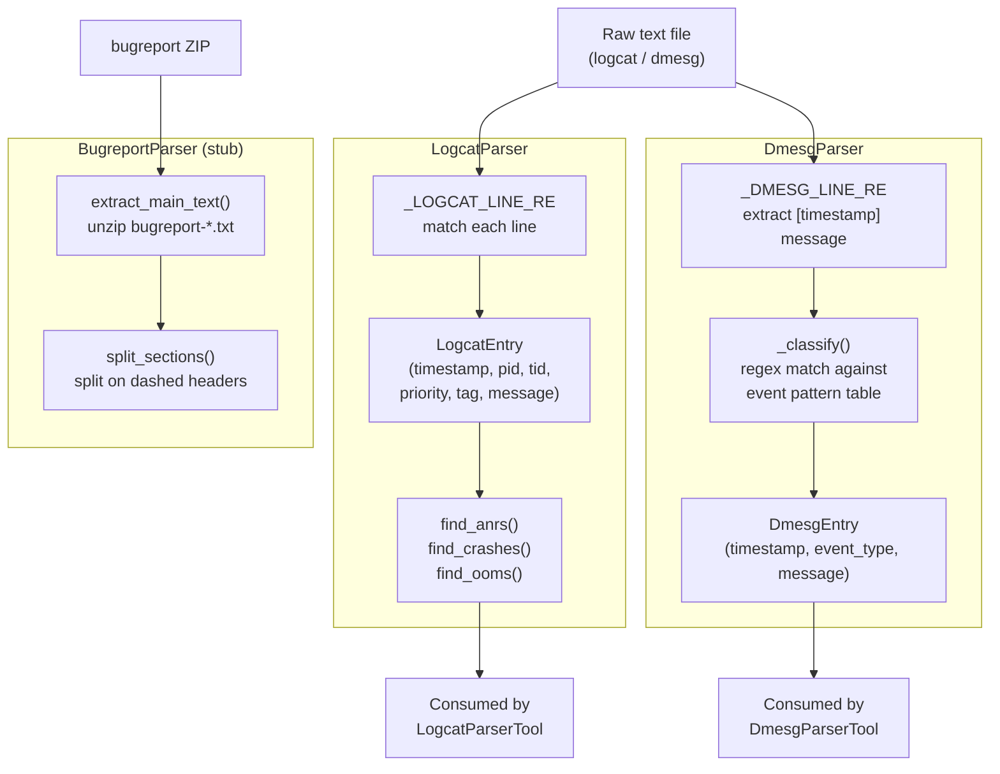

# Component: Log Parsers

**Status: IMPLEMENTED** — `src/parsers/logcat_parser.py`, `src/parsers/dmesg_parser.py`, `src/parsers/bugreport_parser.py`

These are the deterministic, regex-based building blocks the agent calls as
tools. No ML here — this is intentional: cheap, fast, 100% reliable
structure-extraction is exactly what should *not* be delegated to an LLM.

---

## 1. Component Diagram



---

## 2. LogcatParser

**Input format** — standard Android "threadtime" logcat lines:
```
01-15 14:23:07.412  1234  1235 E ActivityManager: ANR in com.example.myapp
```

**Line regex:**
```python
_LOGCAT_LINE_RE = re.compile(
    r"^(?P<timestamp>\d{2}-\d{2}\s+\d{2}:\d{2}:\d{2}\.\d{3})\s+"
    r"(?P<pid>\d+)\s+(?P<tid>\d+)\s+"
    r"(?P<priority>[VDIWEF])\s+"
    r"(?P<tag>[^:]+):\s?(?P<message>.*)$"
)
```
Lines that don't match this shape (e.g. multi-line stack trace continuations,
malformed input) are silently skipped — `parse_file` returns only well-formed
entries. This is a deliberate simplicity trade-off: a production parser might
stitch multi-line exceptions together, but for tool-call purposes (counts,
detection flags, sample lines) per-line parsing is sufficient and much
simpler to reason about.

**Derived detection methods** (each just filters the parsed entries):

| Method | Logic |
|---|---|
| `find_anrs()` | message matches `ANR in\|Input dispatching timed out` |
| `find_crashes()` | priority in `{E, F}` AND `tag + message` matches `FATAL EXCEPTION\|AndroidRuntime.*Exception` |
| `find_ooms()` | message matches `OutOfMemoryError\|Out of memory` |

These booleans are exactly what `LogcatParserTool` surfaces to the agent as
`anr_detected`/`crash_detected`/`oom_detected` — the agent doesn't need to
write its own regexes, it reads a pre-computed signal.

---

## 3. DmesgParser

**Input format** — kernel ring-buffer lines with a bracketed uptime
timestamp:
```
[ 1204.883001] kgsl kgsl-3d0: GPU fault detected for context 45 ts=78912
```

**Line regex:**
```python
_DMESG_LINE_RE = re.compile(r"^\[\s*(?P<timestamp>\d+\.\d+)\]\s*(?P<message>.*)$")
```
Unlike the logcat parser, lines that *don't* match (no bracketed timestamp)
are still kept as a `DmesgEntry` with `timestamp=None` — dmesg output is
noisier and less strictly formatted than logcat, so we don't want to silently
drop content.

**Event classification** — every entry gets tagged by the first matching
pattern in an ordered table:

```python
_EVENT_PATTERNS = [
    ("gpu_fault",    r"kgsl.*fault|GPU fault|GPU hang|Device hanged"),
    ("oom_kill",     r"lowmemorykiller|Killed process|Out of memory: Kill process"),
    ("kernel_panic", r"Kernel panic|BUG:|Oops:"),
    ("thermal",      r"thermal|throttl"),
]
# anything else -> "generic"
```

This is the same idea as `find_anrs`/`find_crashes` above but generalized
into a single classifier function (`_classify`) instead of one method per
category, since dmesg has more categories to track. `DmesgParserTool`
aggregates classified entries with `collections.Counter` to report
`event_type_counts` and booleans (`gpu_fault`, `oom_kill`, `kernel_panic`) to
the agent.

---

## 4. BugreportParser (Stub — Real-Data Stretch Phase)

Android bugreports are ZIP archives containing one big `bugreport-*.txt` with
dashed section headers, e.g.:
```
------ SYSTEM LOG (logcat -v threadtime) ------
... logcat content ...
------ KERNEL LOG (dmesg) ------
... dmesg content ...
```

`BugreportParser.extract_main_text()` unzips and reads that file;
`split_sections()` walks it line by line, and whenever a line matches
`_SECTION_HEADER_RE` (`^-+\s*(?P<name>.+?)\s*-+$`), starts accumulating a new
named section. The result is `dict[section_name, section_text]`, which can
then be fed piecewise into `LogcatParser`/`DmesgParser` for the relevant
sections.

This is intentionally a stub: it hasn't been tested against a real AOSP
bugreport yet (see `CONTEXT.md` → "Stretch — Real AOSP data"). The synthetic
data generator produces standalone logcat/dmesg files directly, so the
bugreport-splitting step isn't on the critical path until real bugreports are
added.

---

## 5. Why Parsing Is Deterministic Code, Not an LLM Call

Worth stating explicitly, since this is an "AI project": extracting
`error_count`, matching a known crash signature, or classifying a dmesg line
by regex are all things regex does *perfectly* and an LLM does
*probabilistically* (with latency and cost on top). The ML value-add is in
the **agent's decision of which parser/tool to reach for and how to interpret
the combined evidence** — not in re-deriving what a `grep` could already
tell you. This separation (deterministic tools + a reasoning layer on top)
is the core argument for why this is an "agentic system" rather than
"an LLM classifier."
