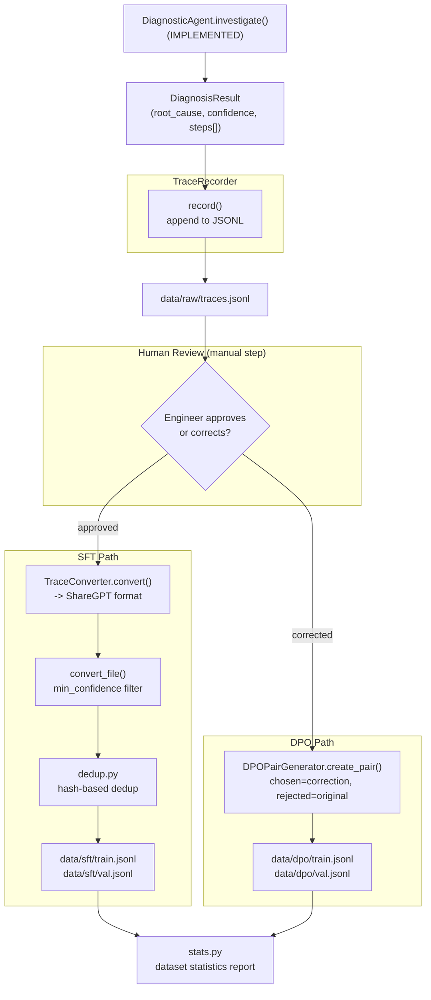

# Component: Training Data Pipeline

**Status: IMPLEMENTED** — `src/training/trace_recorder.py`, `src/training/dpo_generator.py`, `src/training/dedup.py`, `src/training/stats.py`, `scripts/collect_traces.py`, `scripts/build_training_data.py`

Turns every agent investigation into two kinds of training signal: SFT
examples (from successful investigations) and DPO preference pairs (from
human corrections of unsuccessful ones). This is the bridge between "the
agent ran" and "the model got better."

---

## 1. Why This Component Exists

Fine-tuning needs labeled data. Rather than hand-authoring a training set,
the system generates its own: **every production investigation is a
potential training example**, at zero additional annotation cost for the
cases the agent already got right, and targeted human review only for the
cases it got wrong. This is the "traces are gold" principle — see
`docs/ARCHITECTURE.md` and the source capstone doc's mental models.

---

## 2. Architecture



---

## 3. TraceRecorder → Raw Trace Storage

`TraceRecorder.record(result, logcat_path, dmesg_path, description, label)`
appends one JSON line per investigation to `data/raw/traces.jsonl`:

```json
{
  "id": "a1b2c3d4e5f6...",
  "timestamp": "2026-08-01T10:15:00",
  "logcat_path": "...", "dmesg_path": "...", "description": "...",
  "result": { "root_cause": "...", "steps": [ ... full AgentStep list ... ] },
  "ground_truth_label": null
}
```

The `id` is an MD5 hash of `(logcat_path, description, timestamp)` — good
enough for dedup keys and traceability, not a cryptographic requirement.
`result` is the full `asdict(DiagnosisResult)`, which is why preserving
`steps` in `DiagnosisResult` (see [01-diagnostic-agent.md](01-diagnostic-agent.md#4-data-model))
matters: the raw trace file is the permanent record of *how* the agent
reasoned, not just what it concluded.

---

## 4. TraceConverter → ShareGPT SFT Format

Fine-tuning frameworks (here, TRL's `SFTTrainer`) expect conversational
training data. `TraceConverter.convert()` reshapes one raw trace into the
ShareGPT convention — a list of `{"from": role, "value": text}` turns:

1. **system** turn — a condensed version of the diagnostic-engineer persona.
2. **human** turn — the problem description + file paths (mirrors what the
   real agent's user turn looked like).
3. **gpt** turn — the *entire* ReAct trace serialized back into the
   `Thought:/Action:/Action Input:/Observation:/Final Answer:` text grammar,
   built by iterating `result["steps"]` and joining with newlines, ending in
   the JSON-encoded final diagnosis.

**Why re-serialize the trace instead of just training on the final answer:**
the goal is for the fine-tuned model to reproduce the *whole* reasoning
process — which tool to call, in what order, how to interpret an
observation — not just memorize final answers for inputs it's seen before.
Training on the full trace is what actually teaches the ReAct grammar
reliably, directly addressing the format-drift problem documented in
[01-diagnostic-agent.md](01-diagnostic-agent.md#8-known-limitation-regex-parsing-fragility).

**Quality gate:** `convert_file(min_confidence=0.5)` skips any trace where
the agent's self-reported confidence was below the threshold — low-confidence
diagnoses are more likely to be wrong, and training on wrong-but-confident-looking
traces would actively teach the model bad habits. This is a cheap, free proxy
for "is this example worth learning from" before a human ever looks at it.

---

## 5. DPOPairGenerator → Preference Pairs from Corrections

When a human reviewer corrects a diagnosis rather than approving it, that's
a much stronger training signal than a discarded bad trace — it's a direct
**(rejected, chosen)** pair:

```python
DPOPair(
    prompt=user_query,              # the original investigation prompt
    chosen=human_correction,        # what the engineer said the answer should be
    rejected=model_diagnosis,       # what the agent actually said
    metadata={"investigation_id": ..., "source": "human_review"},
)
```

Written to `data/dpo/train.jsonl` in TRL's expected `{prompt, chosen,
rejected}` schema. See
[05-finetuning-pipeline.md](05-finetuning-pipeline.md#3-dpo-training) for how
this trains the model via `DPOTrainer`.

---

## 6. Dedup & Quality Filtering (`dedup.py`)

Two independent problems, both planned for this module:

- **Duplicate detection** — hash the `message`/description field and drop
  near-identical traces (e.g. the same synthetic scenario run repeatedly
  during agent testing shouldn't dominate the training set).
- **Quality filtering** — beyond the confidence threshold already in
  `TraceConverter`, this is where additional heuristics would live (e.g.
  drop traces where the agent hit `MAX_STEPS` without a Final Answer —
  those are exactly the "investigation incomplete" fallback results
  described in [01-diagnostic-agent.md](01-diagnostic-agent.md), which
  contain no useful `Final Answer` to imitate).

---

## 7. Dataset Statistics (`stats.py`)

A reporting step (planned) that prints/logs: total SFT examples, total DPO
pairs, category distribution (are all root-cause categories represented, or
is the dataset skewed toward whatever scenario got tested most?), average
confidence, average trace length. This is the same discipline as checking a
train/val split for class imbalance before training any classifier — cheap
to run, catches data problems before they become a wasted training run.

---

## 8. Verified Run (2026-07-26)

`scripts/collect_traces.py` ran the Phase 1 `DiagnosticAgent` against local
Ollama across all 10 synthetic categories, 2 investigations each (20 total),
recording every trace via `TraceRecorder` to `data/raw/traces.jsonl`. Then
`scripts/build_training_data.py` ran the full pipeline end to end:

```
Step 1: dedup + quality filter raw traces...
  total=20 duplicates_dropped=10 low_quality_dropped=1 kept=9
Step 2: convert survivors to ShareGPT SFT format...
  converted 9 records -> data/processed/sft_all.jsonl
Step 3: train/val split...
  train=7 val=2
Step 4: DPO demo pair from a low-quality trace + matching seed case...
  Wrote 1 DPO demo pair (investigation 4aa12e1d5cbc4b59, category=crash)
Step 5: dataset statistics...
  Avg confidence: 0.91, Avg reasoning steps: 5.1
  Category distribution (train): binder_failure, thermal, memory_leak,
  oom, camera_crash, crash, anr — 1 each
```

**A real bug surfaced and got fixed during this run.** The first collection
attempt crashed with `TypeError: PatternSearchTool.__call__() missing 2
required positional arguments` — the model emitted a tool call with a
malformed/empty `Action Input`, and `DiagnosticAgent._execute_tool()` called
`tool(**args)` with no guard around Python's own argument-binding, so the
`TypeError` happened *before* the tool's internal try/except could catch
anything. Fixed by wrapping that specific call site in
`diagnostic_agent.py` — see [01-diagnostic-agent.md](01-diagnostic-agent.md).
This is exactly the kind of gap that only shows up once an agent runs enough
real, varied investigations — the earlier hand-picked 3-scenario demo never
happened to hit it.

**A real design flaw in dedup was also found and fixed.** The first version
of `dedup_and_filter()` kept whichever occurrence of a repeated investigation
appeared *first* in the raw trace file and discarded the rest as duplicates
— regardless of quality. In practice this meant a failed first run (e.g. the
`crash` scenario's first attempt hit the agent's `MAX_STEPS` fallback,
confidence 0.0) permanently shadowed a later *successful* re-run of the same
scenario (confidence 0.90), which never made it into the SFT set. Fixed by
grouping duplicates and keeping the highest-confidence representative per
group (see `dedup_and_filter()` in `src/training/dedup.py`) — this alone
recovered one extra training example (`kept` went from 8 to 9) and raised
`avg_confidence` from 0.88 to 0.91.

**Why 10 of 20 traces were "duplicates":** each scenario was intentionally
run twice to exercise the dedup path — `_dedup_key()` treats "same
description + same file paths" as the same underlying investigation
regardless of what the model happened to output on a given run, which is
correct: re-running an identical scenario shouldn't multiply its weight in
the training set (see [Section 6](#6-dedup--quality-filtering-deduppy)).

**The DPO demo pair** paired the `crash` scenario's failed first run
(`rejected`, confidence 0.0, "Investigation incomplete — max steps reached")
with `seed_crash_01`'s known-correct diagnosis (`chosen`) from
`data/processed/seed_cases.jsonl` — see
[Section 5](#5-dpopairgenerator--preference-pairs-from-corrections) for why
the seed corpus stands in for a human reviewer here. Both `data/sft/*.jsonl`
and `data/dpo/train.jsonl` are committed to the repo as small, concrete
portfolio artifacts (unlike `data/raw/traces.jsonl`, which is gitignored —
see `.gitignore` — since it's the large, ever-growing, unfiltered source).

---

## 9. How to Explain This Component in an Interview

- "The training data pipeline doesn't require any separate labeling effort —
  it's a direct transform of production traces the agent already generated,
  gated by confidence and human review."
- "SFT and DPO pull from two different points in the same review workflow:
  approved traces become imitation targets, corrected traces become
  preference pairs — same underlying data model, two different training
  objectives."
- "I train on the full reasoning trace, not just the final answer, because
  the failure mode I actually observed (format drift breaking the ReAct
  parser) lives in the *process*, not the final JSON — so that's what needs
  reinforcing."
- "Running this pipeline against 20 real (non-hand-picked) investigations
  surfaced two real bugs — an unhandled `TypeError` on malformed tool
  arguments, and a dedup strategy that let a failed run permanently shadow a
  later successful one. Both were fixed because I ran the pipeline at a
  scale where they could actually show up, not because I anticipated them
  upfront."
