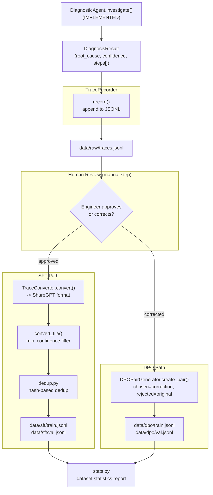

# Component: Training Data Pipeline

**Status: PLANNED (Phase 2)** — target files: `src/training/trace_recorder.py`, `src/training/dpo_generator.py`, `src/training/dedup.py`, `src/training/stats.py`

Turns every agent investigation into two kinds of training signal: SFT
examples (from successful investigations) and DPO preference pairs (from
human corrections of unsuccessful ones). This is the bridge between "the
agent ran" and "the model got better."

---

## 1. Why This Component Exists

Fine-tuning needs labeled data. Rather than hand-authoring a training set,
the system generates its own: **every production investigation is a
potential training example**, at zero additional annotation cost for the
cases the agent already got right, and targeted human review only for the
cases it got wrong. This is the "traces are gold" principle — see
`docs/ARCHITECTURE.md` and the source capstone doc's mental models.

---

## 2. Architecture



---

## 3. TraceRecorder → Raw Trace Storage

`TraceRecorder.record(result, logcat_path, dmesg_path, description, label)`
appends one JSON line per investigation to `data/raw/traces.jsonl`:

```json
{
  "id": "a1b2c3d4e5f6...",
  "timestamp": "2026-08-01T10:15:00",
  "logcat_path": "...", "dmesg_path": "...", "description": "...",
  "result": { "root_cause": "...", "steps": [ ... full AgentStep list ... ] },
  "ground_truth_label": null
}
```

The `id` is an MD5 hash of `(logcat_path, description, timestamp)` — good
enough for dedup keys and traceability, not a cryptographic requirement.
`result` is the full `asdict(DiagnosisResult)`, which is why preserving
`steps` in `DiagnosisResult` (see [01-diagnostic-agent.md](01-diagnostic-agent.md#4-data-model))
matters: the raw trace file is the permanent record of *how* the agent
reasoned, not just what it concluded.

---

## 4. TraceConverter → ShareGPT SFT Format

Fine-tuning frameworks (here, TRL's `SFTTrainer`) expect conversational
training data. `TraceConverter.convert()` reshapes one raw trace into the
ShareGPT convention — a list of `{"from": role, "value": text}` turns:

1. **system** turn — a condensed version of the diagnostic-engineer persona.
2. **human** turn — the problem description + file paths (mirrors what the
   real agent's user turn looked like).
3. **gpt** turn — the *entire* ReAct trace serialized back into the
   `Thought:/Action:/Action Input:/Observation:/Final Answer:` text grammar,
   built by iterating `result["steps"]` and joining with newlines, ending in
   the JSON-encoded final diagnosis.

**Why re-serialize the trace instead of just training on the final answer:**
the goal is for the fine-tuned model to reproduce the *whole* reasoning
process — which tool to call, in what order, how to interpret an
observation — not just memorize final answers for inputs it's seen before.
Training on the full trace is what actually teaches the ReAct grammar
reliably, directly addressing the format-drift problem documented in
[01-diagnostic-agent.md](01-diagnostic-agent.md#8-known-limitation-regex-parsing-fragility).

**Quality gate:** `convert_file(min_confidence=0.5)` skips any trace where
the agent's self-reported confidence was below the threshold — low-confidence
diagnoses are more likely to be wrong, and training on wrong-but-confident-looking
traces would actively teach the model bad habits. This is a cheap, free proxy
for "is this example worth learning from" before a human ever looks at it.

---

## 5. DPOPairGenerator → Preference Pairs from Corrections

When a human reviewer corrects a diagnosis rather than approving it, that's
a much stronger training signal than a discarded bad trace — it's a direct
**(rejected, chosen)** pair:

```python
DPOPair(
    prompt=user_query,              # the original investigation prompt
    chosen=human_correction,        # what the engineer said the answer should be
    rejected=model_diagnosis,       # what the agent actually said
    metadata={"investigation_id": ..., "source": "human_review"},
)
```

Written to `data/dpo/train.jsonl` in TRL's expected `{prompt, chosen,
rejected}` schema. See
[05-finetuning-pipeline.md](05-finetuning-pipeline.md#3-dpo-training) for how
this trains the model via `DPOTrainer`.

---

## 6. Dedup & Quality Filtering (`dedup.py`)

Two independent problems, both planned for this module:

- **Duplicate detection** — hash the `message`/description field and drop
  near-identical traces (e.g. the same synthetic scenario run repeatedly
  during agent testing shouldn't dominate the training set).
- **Quality filtering** — beyond the confidence threshold already in
  `TraceConverter`, this is where additional heuristics would live (e.g.
  drop traces where the agent hit `MAX_STEPS` without a Final Answer —
  those are exactly the "investigation incomplete" fallback results
  described in [01-diagnostic-agent.md](01-diagnostic-agent.md), which
  contain no useful `Final Answer` to imitate).

---

## 7. Dataset Statistics (`stats.py`)

A reporting step (planned) that prints/logs: total SFT examples, total DPO
pairs, category distribution (are all root-cause categories represented, or
is the dataset skewed toward whatever scenario got tested most?), average
confidence, average trace length. This is the same discipline as checking a
train/val split for class imbalance before training any classifier — cheap
to run, catches data problems before they become a wasted training run.

---

## 8. How to Explain This Component in an Interview

- "The training data pipeline doesn't require any separate labeling effort —
  it's a direct transform of production traces the agent already generated,
  gated by confidence and human review."
- "SFT and DPO pull from two different points in the same review workflow:
  approved traces become imitation targets, corrected traces become
  preference pairs — same underlying data model, two different training
  objectives."
- "I train on the full reasoning trace, not just the final answer, because
  the failure mode I actually observed (format drift breaking the ReAct
  parser) lives in the *process*, not the final JSON — so that's what needs
  reinforcing."
