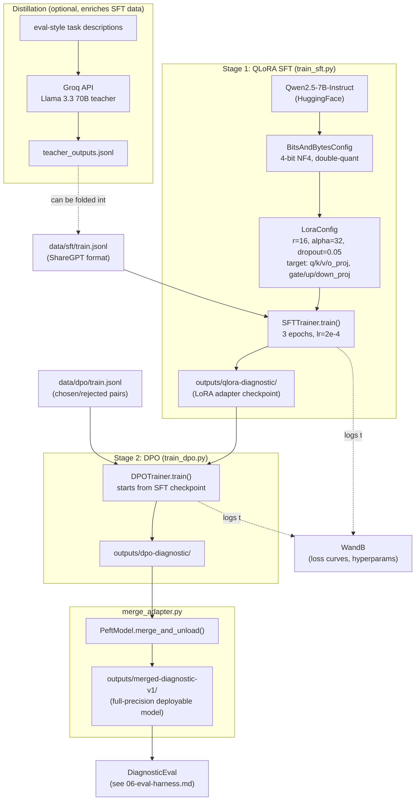

# Component: Fine-Tuning Pipeline (QLoRA + DPO + Distillation)

**Status: PLANNED (Phase 4, requires cloud GPU)** — target files: `src/finetune/qlora_config.py`, `src/finetune/train_sft.py`, `src/finetune/train_dpo.py`, `src/finetune/distill.py`, `src/finetune/merge_adapter.py`

This is where the accumulated training data (Phase 2) actually changes model
weights. It's the densest ML-engineering component in the system and the one
most worth being able to explain precisely in an interview.

**Hardware note:** `bitsandbytes` (4-bit quantization) and the CUDA kernels
QLoRA depends on don't run on Apple Silicon. This entire phase runs on a free
Kaggle T4 GPU notebook (`requirements.cloud.txt`), not on the local Mac —
see `CONTEXT.md` for the cost/hardware rationale.

---

## 1. Architecture



---

## 2. QLoRA Fine-Tuning (SFT Stage)

**The core idea:** full fine-tuning of a 7B model needs to hold gradients and
optimizer state for ~7 billion parameters — 60GB+ of GPU memory even at
mixed precision. QLoRA sidesteps this two ways at once:

1. **Quantize the frozen base model to 4-bit** (`BitsAndBytesConfig(load_in_4bit=True, bnb_4bit_quant_type="nf4", bnb_4bit_use_double_quant=True)`). The base weights are never updated during training, so they can live in a lossy 4-bit representation and only get dequantized on-the-fly for the forward/backward pass.
2. **Only train small LoRA adapter matrices**, injected into specific weight projections:

```python
LoraConfig(
    r=16,               # rank of the low-rank decomposition
    lora_alpha=32,       # scaling factor (commonly ~2x r)
    lora_dropout=0.05,
    target_modules=["q_proj","k_proj","v_proj","o_proj","gate_proj","up_proj","down_proj"],
    bias="none",
    task_type="CAUSAL_LM",
)
```

**What `r` and `alpha` actually mean:** for a frozen weight matrix `W`
(shape `d×k`), LoRA adds `ΔW = (alpha/r) · B·A` where `B` is `d×r` and `A` is
`r×k` — only `r·(d+k)` trainable parameters instead of `d·k`. `r=16` is a
common middle ground: expressive enough to shift model behavior
meaningfully, small enough that `model.print_trainable_parameters()` reports
well under 1% of total parameters as trainable. Higher `r` = more capacity to
learn (and more memory/compute), at the risk of overfitting a small dataset;
lower `r` = cheaper but less able to shift behavior. `alpha` scales the
adapter's effective contribution — the `alpha/r` ratio is what really
matters, and `alpha=2×r` is a widely-used default that keeps the ratio
constant if `r` is tuned later.

**Why these particular `target_modules`:** covering all of `q_proj/k_proj/
v_proj/o_proj` (the full attention block) plus `gate_proj/up_proj/down_proj`
(the full MLP block) — as opposed to just attention — is the standard "full
coverage" QLoRA recipe. It costs a bit more memory/compute than
attention-only LoRA but consistently yields better fine-tuning quality,
which matters more than raw training speed on a free, time-boxed Kaggle T4.

**Training config specifics** (`QLoRAConfig`): `per_device_train_batch_size=2`
with `gradient_accumulation_steps=8` gives an effective batch size of 16
without needing the memory for a batch of 16 sequences at once — the
standard way to trade compute time for memory headroom on a constrained GPU.
`max_seq_length=4096` needs to be long enough to hold a full ReAct trace
(system prompt + investigation + several tool round-trips) — this is
noticeably longer than a typical chat fine-tuning example, a direct
consequence of training on entire reasoning trajectories (see
[04-training-data-pipeline.md](04-training-data-pipeline.md)).

**bf16, not fp16:** `bf16=True` is used for training precision — bfloat16 has
the same exponent range as fp32 (avoiding the overflow/underflow issues fp16
can hit during training) while still halving memory vs. fp32, and modern
GPUs (including the free-tier T4... with some caveats — T4 has limited bf16
throughput, worth validating on the actual Kaggle instance) support it
natively.

---

## 3. DPO Training

Once an SFT checkpoint exists, `train_dpo.py` (planned) continues training
from that checkpoint using TRL's `DPOTrainer` against
`data/dpo/train.jsonl`'s `{prompt, chosen, rejected}` pairs.

**Why DPO instead of classic RLHF (reward model + PPO):** RLHF needs a
separate reward model trained on preference data, then an RL loop (PPO) that
optimizes against that reward model — two training stages, plus RL's
notorious instability and hyperparameter sensitivity. DPO derives a loss
directly from the Bradley-Terry preference model that's mathematically
equivalent to the RLHF objective under a KL constraint, but optimizes it with
plain supervised-learning-style gradient descent on `(chosen, rejected)`
pairs — one training stage, no reward model, no RL instability. For a
project-scale preference dataset (~150 pairs, per the capstone doc's
projections), DPO's simplicity is a large practical win over standing up a
full RLHF pipeline.

**Where the preference pairs come from, concretely:** every pair is
`chosen = human engineer's corrected diagnosis`, `rejected = the agent's
original (wrong or incomplete) diagnosis` for the *same* investigation
prompt — see [04-training-data-pipeline.md](04-training-data-pipeline.md#5-dpopairgenerator--preference-pairs-from-corrections).
This ties DPO training directly to real review decisions rather than
synthetic preference data.

---

## 4. Distillation (Groq Teacher → Qwen2.5-7B Student)

**Concept:** generate diagnostic outputs from a much larger model (the
capstone spec calls for a "72B teacher" — here substituted with **Groq's
free-tier Llama 3.3 70B** to keep cost at $0) for the same task
descriptions used in the eval set, then fold those teacher outputs into the
SFT training data. The 7B student learns to imitate reasoning quality it
couldn't produce zero-shot on its own, without needing 70B-scale inference
at serving time.

```python
def collect_teacher_outputs(tasks, output_path, teacher_model="llama-3.3-70b-versatile"):
    # For each task: prompt the teacher for a detailed root-cause analysis,
    # write {task_id, prompt, teacher_response, teacher_model} to JSONL.
```

(The source capstone doc's reference code calls Claude Opus as the teacher
proxy — for the $0 build this is swapped for Groq's Llama 3.3 70B endpoint,
same OpenAI-compatible-ish call shape, zero cost instead of ~$15/M input +
$75/M output tokens.)

**Why this is worth doing at all, given SFT from the agent's own traces
already exists:** the agent's own successful traces teach the model to
imitate *itself* (useful for consistency and format-following, per
[04-training-data-pipeline.md](04-training-data-pipeline.md)), but can't
exceed the ceiling of what the 7B model could already do zero-shot.
Teacher-generated examples inject reasoning the 7B model *couldn't* have
produced on its own — a genuinely different, complementary training signal.

---

## 5. Merging the Adapter for Deployment

`merge_adapter.py`'s `merge_and_save()` loads the base model in full/bf16
precision (not 4-bit — merging needs the adapter math applied to the actual
weight values), applies `PeftModel.from_pretrained(base_model, adapter_path)`,
then `model.merge_and_unload()` folds the LoRA delta directly into the base
weights, producing a single standalone model directory with no PEFT
dependency needed at inference time. This is what
[07-deployment-serving.md](07-deployment-serving.md) bakes into the airgapped
Docker image — vLLM serves the merged model directly, it has no notion of
"base model + adapter" at all.

---

## 6. How to Explain This Component in an Interview

- "QLoRA let me fine-tune a 7B model on a free-tier T4 with 16GB of VRAM —
  full fine-tuning would need 4x that just for gradients and optimizer
  state."
- "I used DPO instead of full RLHF because my preference data comes directly
  from human corrections in a review workflow — DPO's chosen/rejected format
  maps onto that 1:1 with no reward-model training stage in between."
- "I substituted Groq's free Llama 3.3 70B for Claude Opus as the
  distillation teacher — same technique (learn from a larger model's
  outputs), zero API cost, which mattered given the project's $0 budget
  constraint."
- "The merge step matters operationally, not just academically — vLLM in
  production serves one set of weights, it doesn't want to know about
  adapters at inference time."
