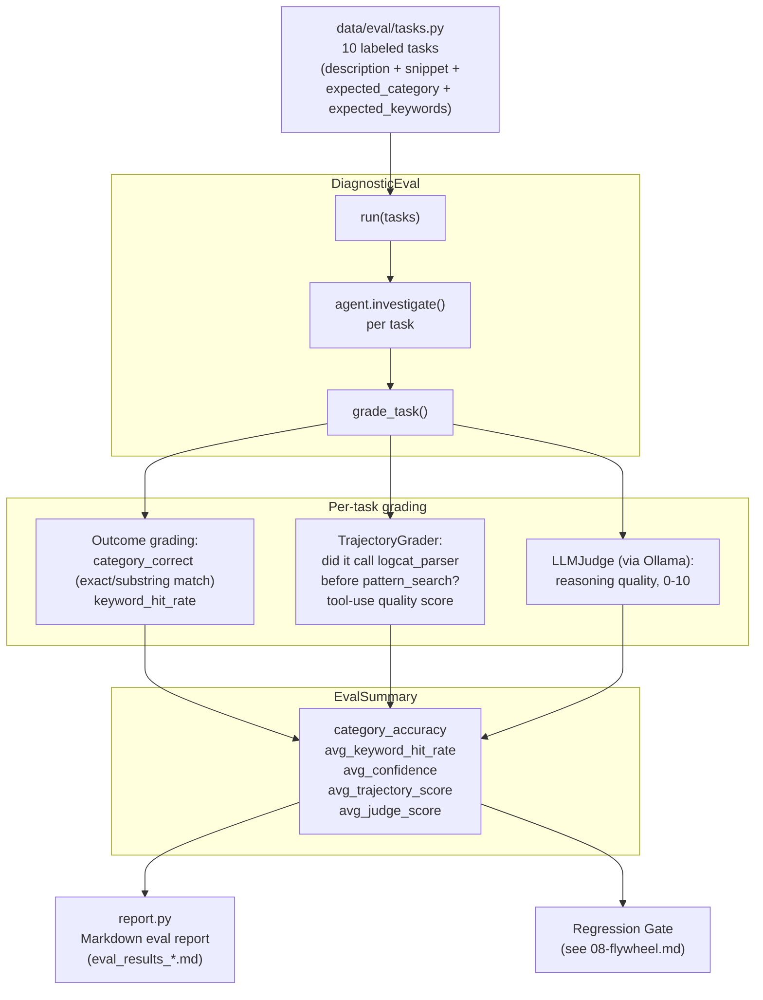

# Component: Eval Harness

**Status: IMPLEMENTED** — `src/eval/diagnostic_eval.py`, `src/eval/trajectory_grader.py`, `src/eval/llm_judge.py`, `src/eval/report.py`, `data/eval/tasks.py`, `scripts/run_eval.py`

The measurement system. Everything downstream — "did fine-tuning help,"
"is it safe to deploy a new model version" — depends on this component
existing and being trustworthy *before* any fine-tuning happens. Mental
model from the source spec: **"eval first, train second"** — without a
baseline, you cannot know whether fine-tuning helped or hurt.

---

## 1. Architecture



---

## 2. The 10 Labeled Eval Tasks

`data/eval/tasks.py` defines `EVAL_TASKS` — one task per root-cause category,
each with a `description`, a `logcat_snippet` or `dmesg_snippet`, an
`expected_root_cause_category`, and `expected_keywords`:

| ID | Category | Example expected keywords |
|---|---|---|
| eval_001 | anr | ANR, dispatching timed out, main thread |
| eval_002 | crash | NullPointerException, FATAL EXCEPTION, onCreate |
| eval_003 | oom | OutOfMemoryError, memory, heap |
| eval_004 | gpu_fault | GPU fault, kgsl, context |
| eval_005 | oom_kill | lowmemorykiller, adj, kswapd |
| eval_006 | thermal | thermal, throttling, temperature |
| eval_007 | camera_crash | CameraDevice, fatal, Camera service |
| eval_008 | kernel_panic | BUG, spinlock, kernel |
| eval_009 | binder_failure | Binder, transaction failed, reply |
| eval_010 | memory_leak | heap, Grow, OutOfMemoryError |

These map directly onto the categories the synthetic log generator already
produces (`scripts/generate_synthetic_logs.py`) — the eval snippets can be
sourced from (or cross-checked against) the same synthetic scenarios already
used to verify the agent in Phase 1.

---

## 3. Outcome Grading — `DiagnosticEval.grade_task()`

Two purely deterministic metrics, computed from the agent's `DiagnosisResult`:

```python
category_correct = (
    predicted_category.lower() == expected_category.lower()
    or expected_category.lower() in predicted_category.lower()
)
hits = sum(1 for kw in expected_keywords if kw.lower() in combined_text)
keyword_hit_rate = hits / len(expected_keywords)
```

**Why substring match, not just exact match, for category:** the model's
`root_cause_category` is free-text-ish (it's whatever string the model
chose to output in its Final Answer JSON), so `"gpu_fault"` should still
count as correct against an expected value the model rendered as
`"gpu_fault_driver_issue"`. This is intentionally lenient — a stricter
production eval might require an enum-constrained category field instead;
that's a natural hardening step once the category taxonomy is finalized.

**`keyword_hit_rate`** checks whether the agent's `root_cause` + `evidence`
text actually mentions the specific technical details a correct diagnosis
should surface (not just the right category label) — this catches the
difference between "got lucky with a category guess" and "actually
identified the mechanism."

---

## 4. Trajectory Grading — `TrajectoryGrader`

Outcome grading alone can't tell the difference between "the agent
investigated properly and reached the right conclusion" and "the agent
guessed the right category without ever looking at the evidence." The
trajectory grader inspects the `steps[]` trace itself:

- Did it call `logcat_parser` (or `dmesg_parser`) *before* jumping to
  `pattern_search`? (matches the recommended investigation order from
  `SYSTEM_PROMPT`, see [01-diagnostic-agent.md](01-diagnostic-agent.md#6-system-prompt-design))
- Did it use a reasonable number of tool calls (not 1 — too shallow; not
  hitting `MAX_STEPS` — didn't converge)?
- Did later steps' patterns/queries actually build on earlier observations
  (e.g. a `pattern_search` regex that references a tag/keyword surfaced in
  the prior `logcat_parser` observation), or were tool calls disconnected
  from each other?

This produces `avg_trajectory_score` — a process-quality metric independent
of whether the final answer happened to be correct. It's directly the tool
that would have flagged the `gpu_fault` scenario in
[01-diagnostic-agent.md §8](01-diagnostic-agent.md#8-known-limitation-regex-parsing-fragility)
as "good evidence gathered, poor Final Answer" rather than lumping it in
with a genuinely confused investigation.

---

## 5. LLM-as-Judge — `LLMJudge`

Some qualities can't be captured by string matching at all — is the
`recommended_action` actually *actionable* for an engineer, is the
`root_cause` explanation internally consistent with the `evidence` listed?
`LLMJudge` prompts a separate LLM call (run via local Ollama — $0, per the
project's cost strategy) to score reasoning quality on a 0–10 scale, given
the task description, the agent's full trace, and its final answer.

**Why a judge model instead of more deterministic rules:** "is this
explanation coherent" is exactly the kind of open-ended quality judgment
LLMs are comparatively good at and regexes cannot approximate. The trade-off
being accepted: judge scores are noisier and less reproducible than
string-match metrics, which is why they're reported as a *supplementary*
average score (`avg_judge_score`) alongside — never instead of — the
deterministic outcome and trajectory metrics.

---

## 6. EvalSummary — The Aggregate Report

```python
EvalSummary(
    total_tasks: int,
    category_accuracy: float,        # THE headline metric — target >70%, baseline ~30%
    avg_keyword_hit_rate: float,
    avg_confidence: float,
    avg_trajectory_score: float,
    avg_judge_score: float,
    per_task_results: list[EvalResult],
)
```

`category_accuracy` is the number that flows into the regression gate (see
[08-flywheel.md](08-flywheel.md)) — everything else is diagnostic detail for
*why* the accuracy is what it is, useful for debugging a bad training run
without re-running the whole eval from scratch.

`report.py` renders this into a Markdown report (`eval_results_baseline.md`,
`eval_results_finetuned.md` once Phase 4 exists) — a durable, diffable
artifact that becomes a portfolio piece showing the before/after accuracy
delta.

---

## 7. Verified Baseline Run (2026-07-26) — and Why 90% ≠ the Spec's ~30%

`scripts/run_eval.py` ran the zero-shot `qwen2.5:7b` agent (no fine-tuning)
against all 10 labeled tasks, with the LLM judge enabled:

```
Total tasks:          10
Category accuracy:    90.0%
Avg keyword hit rate: 0.87
Avg confidence:       0.90
Avg trajectory score: 1.00
Avg judge score:      8.4 / 10
```

This is dramatically higher than the capstone doc's ~30% zero-shot baseline
expectation — worth being precise about *why*, rather than reporting 90% as
an unqualified win:

1. **The eval snippets are not adversarial.** Each `logcat_snippet`/
   `dmesg_snippet` contains an almost literal category signature (`"ANR in
   com.example.myapp"`, `"GPU fault"`, `"BUG: spinlock"`,
   `"OutOfMemoryError"`) — recognizing the category from these snippets is
   close to a keyword-matching problem, not a hard diagnostic-reasoning
   problem. A real bugreport's signal is buried in thousands of unrelated
   lines; these 3-line snippets are not.
2. **RAG-corpus / eval-set leakage.** `data/processed/seed_cases.jsonl` and
   `data/eval/tasks.py` were both hand-written by the same author, working
   from the same category list, at the same time — e.g. eval_001's
   description ("App freezes and shows ANR dialog after **5 seconds** of
   use") is nearly a word-for-word paraphrase of `seed_anr_01` ("App freezes
   and shows ANR dialog after **several seconds** of use, input dispatching
   times out"). `rag_retriever` reliably retrieves the near-exact answer
   for most tasks, which is a form of eval contamination — the seed corpus
   wasn't built independently from the eval set the way a real held-out
   test set would be.
3. **Only 1 miss, and it's a genuinely defensible one, not a bug:**
   `eval_010` (expected `memory_leak`) was predicted `oom` — the snippet's
   last line is literally `"OutOfMemoryError: Java heap space"` (the *same*
   terminal signal `eval_003`'s `oom` task uses), and nothing in a single
   snapshot distinguishes "this heap growth is a leak" from "this heap
   growth is legitimate load that exhausted memory" without observing
   growth across multiple sessions. The model's confusion mirrors a real
   ambiguity in the category taxonomy, not a reasoning failure.
4. **Trajectory score saturated at a perfect 1.00 across all 10 tasks** —
   the three-check rubric (started with a parser tool, no immediate
   repeated tool call, reasonable step count) turned out to have no
   discriminative power at this task set's difficulty level; every
   investigation cleanly passed all three checks. A harder/noisier task set
   (or intentionally degraded agent behavior) would be needed to see this
   metric actually vary.

**What this means for Phase 4 expectations:** this 90%/1.00/8.4 baseline is
a ceiling effect from an easy, non-independent eval set — it does **not**
mean fine-tuning has nothing left to improve. The real test of QLoRA/DPO
fine-tuning's value will show up more clearly against harder real-world
bugreport data (the "Stretch — Real AOSP data" phase in `CONTEXT.md`) or a
deliberately adversarial eval set built independently from the RAG seed
corpus. The harness itself — outcome/trajectory/judge grading, JSON+Markdown
reporting — is fully functional and ready for that harder eval set whenever
it exists; only the *current 10 tasks* are the easy case.

---

## 8. How to Explain This Component in an Interview

- "I evaluate three orthogonal things, not one blended score: did it reach
  the right conclusion (outcome), did it get there sensibly (trajectory),
  and was the reasoning actually good writing (LLM judge) — collapsing those
  into one number would hide exactly the failure modes I need to see to
  debug the agent or the fine-tuning run."
- "The eval harness exists and has a baseline *before* any fine-tuning
  happens — otherwise there's no way to attribute a later accuracy number to
  the fine-tuning actually working versus random variance."
- "Every eval task doubles as a synthetic data-generation category — the
  same 10 root-cause categories the synthetic log generator produces are
  exactly what the eval set measures, so there's no drift between 'what the
  agent is trained/tested against' and 'what data actually exists.'"
- "My baseline came back at 90%, not the ~30% the spec expected — and I
  didn't just report that. I traced it to two real causes: the eval
  snippets contain near-literal category keywords, and my RAG seed corpus
  was written by me, at the same time, from the same category list as the
  eval tasks, so retrieval was handing back near-answers. That's a genuine
  eval-design lesson — a seed/reference corpus and an eval set should be
  built independently, or contamination is exactly what you get."
