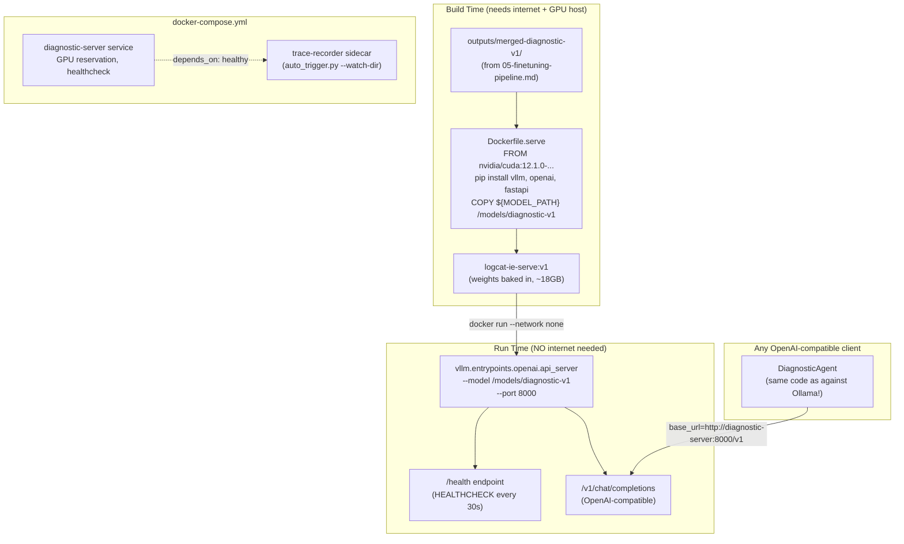

# Component: Deployment & Serving

**Status: PLANNED (Phase 5)** — target files: `docker/Dockerfile.serve`, `docker/docker-compose.yml`, `src/serve/health.py`, `src/serve/client.py`

Serves the fine-tuned, merged model behind an OpenAI-compatible API, inside
a Docker image that needs **zero network access at runtime**. This is the
"production awareness" component — the difference between a model that
works in a notebook and one that can run in a restricted/secure environment.

---

## 1. Architecture



---

## 2. Why vLLM

vLLM is a high-throughput inference server built around **PagedAttention** —
it manages the GPU memory used for attention key/value caches in fixed-size
pages (like OS virtual memory), which lets it batch many concurrent
requests without wasting memory on over-allocated, contiguous KV-cache
buffers. Practically, this means:

- Much higher throughput than naive HuggingFace `generate()` serving under
  concurrent load — relevant since the target metric is "12 diagnoses/minute"
  throughput, not just single-request latency.
- **OpenAI-compatible API out of the box**
  (`vllm.entrypoints.openai.api_server`) — the exact same `openai` Python
  client and `chat.completions.create()` call that `DiagnosticAgent` already
  uses against Ollama in development works unmodified against vLLM in
  production. Zero agent code changes between dev and prod backbones — only
  `OPENAI_BASE_URL` changes.

**Mac constraint:** vLLM requires CUDA; it cannot run natively on Apple
Silicon. Real inference testing happens on the same free Kaggle T4 (or a
future paid RunPod/Lambda instance) used for training — on the Mac, Docker
build/health-check plumbing can be smoke-tested, but not actual GPU
inference.

---

## 3. The Airgapped Dockerfile

```dockerfile
FROM nvidia/cuda:12.1.0-cudnn8-runtime-ubuntu22.04
RUN apt-get update && apt-get install -y python3.11 python3-pip git
COPY requirements.serve.txt .
RUN pip install --no-cache-dir vllm==0.4.2 openai==1.14.0 fastapi==0.110.0 uvicorn==0.29.0
ARG MODEL_PATH=./outputs/merged-diagnostic-v1
COPY ${MODEL_PATH} /models/diagnostic-v1
COPY src/serve/ /app/serve/
EXPOSE 8000
HEALTHCHECK --interval=30s --timeout=10s --start-period=60s \
    CMD curl -f http://localhost:8000/health || exit 1
CMD ["python3", "-m", "vllm.entrypoints.openai.api_server", "--model", "/models/diagnostic-v1", ...]
```

**"Airgapped" means dependencies are data, baked in at build time** — the
key line is `COPY ${MODEL_PATH} /models/diagnostic-v1`. Everything the model
needs at runtime (weights, tokenizer config, chat template) is copied into
the image *during the build*, which is the one point where internet access
and a GPU host are assumed. Once built, the image is a self-contained,
versioned artifact: `docker run --network none logcat-ie-serve:v1` must
still serve correctly, because nothing in the `CMD` reaches out to
HuggingFace Hub, PyPI, or anywhere else at runtime.

**Why `ARG MODEL_PATH` instead of hardcoding a path:** every retrain (see
[08-flywheel.md](08-flywheel.md)) produces a new merged model directory
(`outputs/merged-diagnostic-vN`); the build arg lets `weekly_retrain.sh`
rebuild a freshly-tagged image (`logcat-ie-serve:vN`) pointing at the new
weights without touching the Dockerfile itself.

---

## 4. docker-compose Orchestration

Two services:

- **`diagnostic-server`** — the vLLM container, with a `deploy.resources.reservations.devices` GPU reservation and a `healthcheck` block so dependent services wait for `/health` to actually respond before starting.
- **`trace-recorder`** (optional sidecar) — runs `auto_trigger.py --watch-dir /app/data/raw` (see [08-flywheel.md](08-flywheel.md)) pointed at the same served model via `VLLM_BASE_URL`, so newly investigated cases keep flowing into the trace corpus even in a deployed environment, not just during local development.

`depends_on: condition: service_healthy` is the mechanism that prevents the
sidecar from hammering a vLLM instance that's still loading weights into GPU
memory (which, for a 7B model, is not instantaneous).

---

## 5. Health Check & Smoke Test

```bash
docker build --build-arg MODEL_PATH=./outputs/merged-diagnostic-v1 -f docker/Dockerfile.serve -t logcat-ie-serve:v1 .
docker-compose -f docker/docker-compose.yml up -d
curl http://localhost:8000/health
curl -X POST http://localhost:8000/v1/chat/completions -d '{...}'
```

The health check endpoint (`src/serve/health.py`, planned) is what both
Docker's own `HEALTHCHECK` directive and docker-compose's
`healthcheck:`/`depends_on: condition: service_healthy` rely on — a cheap,
fast way to distinguish "container is up" from "model is actually loaded and
ready to answer," which for a 7B model on a T4 is not the same instant.

---

## 6. How to Explain This Component in an Interview

- "The airgapped requirement forced a specific discipline: anything the
  model needs has to be a build-time dependency, never a runtime one — the
  `COPY` instruction baking weights into the image is the whole trick."
- "I get dev/prod parity for free because vLLM speaks the same
  OpenAI-compatible API my agent already calls against Ollama — swapping
  backbones is a config change, not a code change."
- "The image is versioned and reproducible by design — every retrain cycle
  produces a new tagged image (`logcat-ie-serve:vN`) rather than mutating a
  running container, which is what makes the regression gate (rebuild only
  if eval passes) meaningful."
