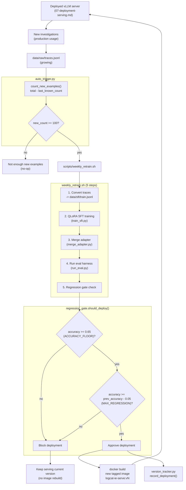

# Component: The Flywheel (Auto-Retrain + Regression Gate)

**Status: PLANNED (Phase 6)** — target files: `src/flywheel/auto_trigger.py`, `src/flywheel/regression_gate.py`, `src/flywheel/version_tracker.py`, `scripts/weekly_retrain.sh`

This is the component that closes the loop and turns everything else into a
*system that improves itself* rather than a one-time fine-tuning exercise.
Mental model from the source spec: **the flywheel is the real product** —
any model shipped on day one is mediocre because training data is limited;
what compounds over months of production use is the automated pipeline that
keeps re-training on freshly accumulated, human-verified traces.

---

## 1. Architecture



---

## 2. Auto-Retrain Trigger

```python
RETRAIN_THRESHOLD = 100  # new verified examples before triggering retrain

def count_new_examples(traces_path, last_count_path) -> int:
    total = sum(1 for _ in open(traces_path))
    last = int(last_count_path.read_text()) if last_count_path.exists() else 0
    return total - last

def trigger_retrain(traces_path, last_count_path) -> bool:
    if count_new_examples(...) < RETRAIN_THRESHOLD:
        return False
    result = subprocess.run(["bash", "scripts/weekly_retrain.sh"], ...)
    if result.returncode == 0:
        last_count_path.write_text(str(total))  # advance the watermark
        return True
    return False  # do NOT advance the watermark on failure — retry next check
```

**Why a simple line-count watermark instead of a timestamp or database:**
`data/raw/traces.jsonl` is append-only (see
[04-training-data-pipeline.md](04-training-data-pipeline.md)), so "how many
new lines since I last retrained" is just `total_lines - last_known_count` —
no need for a database or even structured trace metadata to answer "is it
time yet." The watermark file (`last_count_path`) is only advanced *after* a
successful retrain, so a failed run doesn't lose track of un-trained
examples — the next check will see the same (or larger) `new_count` and
retry.

**Why a fixed threshold (100) rather than a fixed schedule (e.g. "daily"):**
ties retraining cadence to actual signal volume rather than the calendar — a
quiet week with 20 new traces doesn't trigger a low-value retrain; a busy
week with 300 new traces could trigger multiple cycles. This is the same
reasoning as "eval-gated CI" vs. "scheduled deploys": trigger on a meaningful
condition, not a clock.

---

## 3. Regression Gate

```python
ACCURACY_FLOOR = 0.65      # absolute minimum acceptable accuracy
MAX_REGRESSION = 0.05      # max allowed drop from the currently-deployed version

def should_deploy(new_accuracy, previous_accuracy_path) -> tuple[bool, str]:
    if new_accuracy < ACCURACY_FLOOR:
        return False, f"below floor {ACCURACY_FLOOR:.2%}"
    if previous_accuracy_path.exists():
        prev = json.loads(previous_accuracy_path.read_text())["accuracy"]
        if new_accuracy < prev - MAX_REGRESSION:
            return False, f"regression vs previous {prev:.2%}"
    return True, "passes all gates"
```

**Two independent checks, not one:**

1. **Absolute floor** — never deploy a model that's simply bad in isolation,
   regardless of what came before (protects against, e.g., a corrupted
   training run producing a technically-non-regressing-but-still-terrible
   model if the previous version happened to also be bad).
2. **Relative regression** — never deploy a model that's meaningfully *worse*
   than what's currently live, even if it still clears the absolute floor
   (protects against slow degradation across many retrain cycles — a model
   could stay above 0.65 while still creeping downward release after
   release without this check).

This is the automated-CI-gate pattern applied to a model artifact instead of
a code artifact: `should_deploy()` is conceptually identical to "does this
build pass its test suite," just measured by `DiagnosticEval.category_accuracy`
(see [06-eval-harness.md](06-eval-harness.md)) instead of unit tests.

**On gate failure:** the pipeline does *not* delete the failed checkpoint or
crash — it just skips the Docker rebuild and deployment step, leaving the
currently-serving version untouched. The failed training run's artifacts
remain available for debugging (why did accuracy drop? bad data batch? LR
too high? a regression in the DPO stage specifically?).

---

## 4. `weekly_retrain.sh` — The Full Pipeline, End to End

```bash
MODEL_VERSION="v$(date +%Y%m%d)"
# 1. Convert new traces -> SFT format (TraceConverter, min_confidence=0.6)
# 2. Run QLoRA SFT training (train_sft.py)
# 3. Merge LoRA adapter (merge_adapter.py)
# 4. Run eval harness against the new merged model, capture accuracy
# 5. regression_gate.should_deploy(accuracy, ...) ->
#      if yes: record_deployment() + docker build --build-arg MODEL_PATH=... -t logcat-ie-serve:$MODEL_VERSION
#      if no:  exit 1 (script fails loudly, no image built)
```

Despite the name "weekly," this script is triggered by volume
(`auto_trigger.py`'s threshold check), not literally a weekly cron — "weekly"
in the capstone spec describes the *expected typical cadence* once the
system is in steady-state production use, not a hardcoded schedule.

---

## 5. Version Tracking

`version_tracker.py` (planned) — records each deployed version's tag and
accuracy (the same JSON file `regression_gate.py` reads as
`previous_accuracy_path`), building up a history like:

```
v1 (baseline QLoRA)  — accuracy: 70% — deployed 2026-08-15
v2 (+100 new traces) — accuracy: 74% — deployed 2026-08-22
v3 (+100 new traces) — accuracy: 77% — deployed 2026-08-29
```

This history is itself a portfolio artifact — a visible, monotonic(-ish)
accuracy trend across retrain cycles is the concrete evidence that the
flywheel claim ("the system improves itself over time") is real and not just
architectural aspiration.

---

## 6. How to Explain This Component in an Interview

- "The flywheel is genuinely the part of this project I'd point to as the
  differentiator — anyone can fine-tune a model once; the interesting
  engineering problem is deciding *when* to retrain, and *whether* the result
  is safe to ship, both automatically."
- "The regression gate has two independent failure conditions on purpose —
  an absolute floor and a relative-regression check — because either one
  alone misses a real failure mode: a bad-in-isolation model, or a slow
  creeping decline across many cycles."
- "Retraining triggers on accumulated signal volume, not a calendar schedule
  — the same philosophy as event-driven CI over cron-scheduled builds."
- "A failed regression-gate check is a safe no-op, not a rollback scramble —
  the currently deployed image is simply left alone, and the failed
  checkpoint stays around for debugging."
